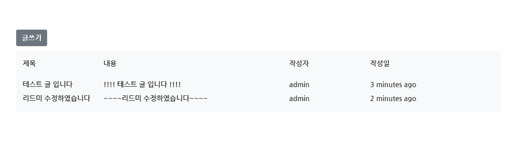

# Final-Pjt


[TOC]

## 제작기간

2021.05.20 - 2021.05.27

## 팀원소개

- 정원화(팀장)
- 김다윗 

## 📗 시작 전 CHECK_LIST

### :ballot_box_with_check: pip 설치

> 프로젝트에 필요한 pip를 설치한다. 

- `final-pjt-back/requirements.txt` 파일을 참조한다.
- 주어진 JSON 파일을 DB에 로드 `$ python manage.py loaddata movies.json`

### :ballot_box_with_check: npm 설치

- npm 사용을 위해서 `node.js`와 `Vue Cli`가 설치되어 있는지 확인한다.
- `final-pjt-front` 폴더 안에서 아래의 명령어를 실행해본다.

```bash
$ node -v
```

```bash
$ vue --version
```

- 이후 아래의 npm을 설치한다.

```bash
$ npm install
```

- 기본 Vue 프로젝트 생성 이후, 추가적으로 설치한 npm은 아래와 같다.

```bash
$ npm install axios
$ npm install bootstrap-icons
$ npm install bootstrap-vue
$ npm install moment
$ npm install vue-router
$ npm install vuex
```

### :ballot_box_with_check: .env.local

> Vue 클라이언트 프로젝트의 최상위 폴더에는 `.env.local` 파일이 작성되어 있으며, 이것은 gitignore로 관리되어 있기 때문에 반드시 해당 파일을 생성하고 프로젝트를 진행하도록 한다.

- `.env.local` 파일에는 다음과 같은 데이터가 저장되어 있다.
  - `서버 url`
  - API_KEY

```
VUE_APP_SERVER_URL=http://127.0.0.1:8000
VUE_APP_THEMOVIEDB_API_KEY="5baac7ac711a4bc84e4d345fc917a4da"
```


## 1 .팀원 정보 및 업무 분담 내역

### 공통업무 : front (Main, Search, MovieDetail) 및 back 기본 모델링 

### 팀장 : 정원화

- `moviedetailreview`, `style`, `css`

### 팀원 : 김다윗

- `article`, `comment`, `login`, `signup`

  

## 2. 목표 서비스 구현 및 실제 구현 정도

### 2.1 목표 서비스

> 우리 팀이 처음에 기획한 서비스는 다음과 같다.

```markdown
## 1. 영화 조회 서비스
- DB 기반 전체 영화 조회
- 장르별 영화 조회
- 영화 상세 조회
- Youtube 영상 제공
## 2. 영화 추천 서비스
- 이상형 월드컵 형식 영화 추천 : 이상형 월드컵을 통해 사용자가 선호하는 장르를 데이터로 받아 이에 해당하는 장르가 많이 포함된 영화 추천
## 3. community 기능
- 영화 리뷰 및 평점 작성
- 댓글 작성
```


### 2.2 실제 구현 서비스

- 컴포넌트 구조 


```markdown
## 1. 영화 조회 서비스
- API 데이터 기반 영화조회 서비스
- 조회한 영화 정보 및 Youtube 영상 제공
## 2. 영화 추천 서비스
- 랜덤 추천
## 3. community 기능
- 영화 리뷰 및 평점 작성
- 댓글 작성
```


## 3. 데이터베이스 모델링(ERD)


### 1. articles app의 Models.py 

* MovieReview Model - User와 MovieReview (1:N 관계)  

- Article Model - User와 Article (1:N 관계)  
- Comment Model  - User와 Comment (1:N관계)
- Comment Model - article 와 comment (1:N관계)

```python
from django.db import models
from django.conf import settings

class MovieReview(models.Model):
    user = models.ForeignKey(settings.AUTH_USER_MODEL, on_delete=models.CASCADE, related_name="movie_reviews")
    movie_title = models.CharField(max_length=50)
    title = models.CharField(max_length=100)
    movie_id = models.IntegerField()
    rank = models.IntegerField(default=1)
    content = models.TextField()
    created_at = models.DateTimeField(auto_now_add=True)
    updated_at = models.DateTimeField(auto_now=True)
    username = models.CharField(max_length=100)


class Article(models.Model):
    user = models.ForeignKey(settings.AUTH_USER_MODEL, on_delete=models.CASCADE)
    title = models.CharField(max_length=100)
    content = models.TextField()
    created_at = models.DateTimeField(auto_now_add=True)
    updated_at = models.DateTimeField(auto_now=True)
    username = models.CharField(max_length=100)


class Comment(models.Model):
    article = models.ForeignKey(Article, on_delete=models.CASCADE)
    user = models.ForeignKey(settings.AUTH_USER_MODEL, on_delete=models.CASCADE)
    content = models.TextField()
    created_at = models.DateTimeField(auto_now_add=True)
    updated_at = models.DateTimeField(auto_now=True)
    username = models.CharField(max_length=100)
```

### 2. posts app의 Models.py 

- Post Model - post 와 genre(1:N 관계)  

```python
from django.db import models

class Genre(models.Model):
    name = models.CharField(max_length=50)

class Post(models.Model):
    title = models.CharField(max_length=100)
    release_date = models.DateField()
    popularity = models.FloatField()
    vote_count = models.IntegerField()
    vote_average = models.FloatField()
    overview = models.TextField()
    poster_path = models.CharField(max_length=200)
    genres = models.ManyToManyField(Genre)
```


## 4. 필수 기능에 대한 설명

### 4.1  영화목록 조회 

* store/index.js

```javascript
import Vue from 'vue'
import Vuex from 'vuex'

Vue.use(Vuex)

export default new Vuex.Store({
  state: {
    loading: true,
    nowPlaying:[],
    popular:[],
    upComing:[]
  },
  mutations: {
    SET_LOADING(state, data){
      state.loading = data;
    },
    SET_NOW_PLAYING(state, data){
      state.nowPlaying = data;
    },
    SET_POPULAR(state, data){
      state.popular = data;
    },
    SET_UP_COMING(state, data){
      state.upComing = data;
    }
    
  },
  actions: {
  },
  modules: {
  }
})

```

- utils/axios.js

```javascript
import axios from "axios"

const DOMAIN = "https://api.themoviedb.org/3/"
const API_KEY = process.env.VUE_APP_THEMOVIEDB_API_KEY
const request = axios.create({
  baseURL: "https://api.themoviedb.org/3/",
  params: {
    api_key: API_KEY,
    language: "ko-KR",
  },
});
export const movieApi = {
  nowPlaying: () => request.get("movie/now_playing"),
  popular: () => request.get("movie/popular"),
  upComing: () => request.get("movie/upcoming"),
  movieDetail: (id) =>
    request.get(`movie/${id}`, {
      params: { append_to_response: "videos" },
    }),
  search: (keyword) =>
    request.get(`search/movie/`, {
      params: {
        query: keyword,
      },
    }),
}
```

* Search.vue(영화목록조회)


```javascript
export default {
  data(){
    return {
      keyword:"",
      movieList:""
    }
  },
  components:{
    MovieText,
    MovieLists
  },
  created(){
  this.SET_LOADING(false)
  },
  methods:{
    ...mapMutations(["SET_LOADING"]),
    async onSearch(){
      this.SET_LOADING(true)
      console.log(this.keyword)
      if(!this.keyword){
          alert("영화 제목을 입력하세요!")
          this.keyword = ""
          return
      }
      const {data} = await movieApi.search(this.keyword)
      console.log(data)
      this.movieList=data.results
      this.SET_LOADING(false)
      this.keyword = ""
    },
  }
}
```

- MovieLists.vue 

```javascript
export default {
  props: ['movieList'],
  data(){
    return {
      noImage: require("../assets/error.jpg")
    }
  }
,
  methods: {
    image(img) {
      return `https://image.tmdb.org/t/p/w300/${img}`
    },
     goDetail(id){
      // console.log(id)
      this.$router.push(`detail/${id}`)
    }
  },
}
```

- MovieListsVuex.vue

```vue
import { mapState } from 'vuex'
export default {


  computed:{
    ...mapState(["nowPlaying"])
  },
  methods: {
    image(img) {
      return `https://image.tmdb.org/t/p/w300/${img}`
    },
    goDetail(id){
      // console.log(id)
      this.$router.push(`detail/${id}`)
    }
  },
}
```

* MovieDetail.vue(youtube 영상 및 해당 영화 평점 남기기)


```javascript
const SERVER_URL = process.env.VUE_APP_SERVER_URL

export default {
  data() {
    return {
      movieDetail: {},
      Reviews : [],
      me : localStorage.getItem('username')
    }
  },
  async mounted() {
    this.SET_LOADING(true)
    console.log(this.$route)
    console.log(this.$route.params.id)
    const { id } = this.$route.params
    const { data } = await movieApi.movieDetail(id)
    // axios 요청 보내기
    console.log(data)
    this.movieDetail = data
    this.SET_LOADING(false)
    // backdro
  },
  methods: {
    ...mapMutations(["SET_LOADING"]),
    image(img) {
      console.log()
      return `https://image.tmdb.org/t/p/original/${img}`
    },
    youtube(src) {
      return `https://www.youtube.com/embed/${src}`
    },
    setToken : function () {
      const token = localStorage.getItem('jwt')
      const config = {
        headers : {
          Authorization : `JWT ${token}`,
        }
      }
      return config
    },
    getStar (rank) {
      let rankStar = '★'
      for (let i=1;i<rank;i++){
        rankStar += '★'
      }
      return rankStar
    },
    onDelete : function (review) {
      const config = this.setToken()
      axios.delete(`${SERVER_URL}/articles/movie_review_delete/${review.id}/`,config)
      .then(()=>{
      this.$router.go(this.$router.currentRoute)
      })
      .catch((err)=>{
        console.log(err)
      })
    },
  },
  created: function () {
    const config = this.setToken()
    axios.get(`${SERVER_URL}/articles/movie_review_list_create/`,config)
    .then((res)=>{  
      this.Reviews = res.data
      }).catch((err)=>{
      console.log(err)
    })  
  }
}
```


### 4.2 추천 서비스

- Recommend.vue에서 카테고리 선택하여 추천 
  - 최신, 인기, 평점을 기준으로 각각 선택하는 목록에 대하여 정렬하여 보여줌


```javascript
<template>
    ...
    <select v-model="mode" class="btn btn-light border d-flex justify-content-start form-select mb-4" style="width:30%">
      <option value="latest">최신 영화 추천</option>
      <option value="popular">인기 영화 추천</option>
      <option value="vote">평점순 영화 추천</option>
    </select>
	...
</template>

export default {
  data : function () {
    return {
      mode: 'latest',
      movieList: [],
    } 
  },
  methods : {
    setToken : function () {
      const token = localStorage.getItem('jwt')
      const config = {
        headers : {
          Authorization : `JWT ${token}`,
        }
      }
      return config
    },
    getMovies: function () {
      const config = this.setToken()
      const mode = this.mode
      axios.get(`${SERVER_URL}/posts/recommended?mode=${mode}`,config, {params: {mode: this.mode}})
      .then((res)=>{  
        this.movieList = res.data
        }).catch((err)=>{
        console.log(err)
        })
      },
  },
  watch: {
    mode: {
      handler: function () {
        this.getMovies()
      }
    }
  },
  created: function () {
    this.getMovies()
  }
}
```


### 4.3  커뮤니티 기능 

- article 쓰기, 수정, 삭제 기능 구현 

  - 쓰기 (ArticleCreated)

  

  

  

  ```javascript
    methods : {
      onArticle : function () {
        const Article = {
          title: this.title,
          content: this.content,
          username: this.username,
        }
  
        axios({
            method: 'POST',
            url: SERVER_URL + '/articles/',
            headers: {
            Authorization: `JWT ${localStorage.getItem('jwt')}`
          },
          data: Article
        }).then(() => {
            this.$router.push({name : "ArticleList"})
          }).catch((err) => {
            console.log(err)
          })
      }
    }   
  ```

  - 수정  (ArticleUpdate)

  

  

  ```javascript
  methods : {
        setToken : function () {
        const token = localStorage.getItem('jwt')
        const config = {
          headers : {
            Authorization : `JWT ${token}`,
          }
        }
        return config
      },
      onArticle : function () {
        const config = this.setToken()
        axios.put(`${SERVER_URL}/articles/${this.$route.params.review.id}/`,this.Article,config)
        .then((res)=>{
          console.log(res)
          this.$router.push({name : "ArticleList"})
        }).catch((err)=>{
          console.log(err)
        })
      }
    }
  ```

  

  - 삭제  (ArticleDetail)

  

  ```javascript
      methods : {
      setToken : function () {
        const token = localStorage.getItem('jwt')
        const config = {
          headers : {
            Authorization : `JWT ${token}`,
          }
        }
        return config
      },
      onDelete : function (id) {
        const config = this.setToken()
        axios.delete(`${SERVER_URL}/articles/${id}/`,config)
        .then(()=>{
          this.$router.push({name : 'ArticleList'})
        })
        .catch((err)=>{
          console.log(err)
        })
      }
    },
  ```


## 5. 오류 디버깅

### 5.1 serializer 관련 오류

> 게시글을 작성할 때 작성자와 게시글의 관계를 나타내려고 하는 부분에서 `user`의 정보가 들어있지 않다는 오류가 발생하였음.

**문제상황**

- articles/views.py (article을 생성해주는 함수)

  - ```python
    serializer = ArticleSerializer(data=request.data)
    if serializer.is_valid(raise_exception=True):
        serializer.save(user=request.user)
        return Response(serializer.data, status=status.HTTP_201_CREATED)         
    ```

  * `serializer.is_valid(raise_exception=True):` 이 부분에서 걸려 `user` 정보를 받아가지 못하여 계속해서 에러가 발생하였다. 

**해결방안**

- `serializers`에서 `user` 정보를 `read_only_fields`에 담아 유효성 검사를 피하게 함으로써 에러가 발생하는 문제를 해결하였다. 


### 5.2 User 문제 

> 유저 정보가 필요하게 `modeling`을 한 후 `django`에서 함수를 작성할 때 `@authentication_classes([JSONWebTokenAuthentication])`, `@permission_classes([IsAuthenticated])` 해당 데코레이터를 누락하여 `anonymous user` 에러가 계속해서 발생하였다.  

* **해결방안**
  - `@authentication_classes([JSONWebTokenAuthentication])`, `@permission_classes([IsAuthenticated])` 해당 데코레이터를 추가해 줌으로써 에러 문제를 해결하였다. 


## :exclamation: 6. 느낀점

```
	
	마지막 프로젝트인 영화 추천 사이트를 만들면서 vue.js와 django에 더 친숙해지고 더 잘 다룰 수 있게 되었다. 수업시간을 통해 배웠던 이론들과 명세를 기반으로 하나씩 구현하여 작동하는 결과물을 보니 큰 만족감이 있었다. 

	막연하게 이론과 생각을 통해서 상상코딩을 했을 때는 큰 어려움 없이 수월하게 프로젝트가 진행될 것이라 생각하였다. 하지만, 실제 프로젝트를 진행하며 학습하며 인지하지 못하였던 부족한 점과 생각지도 못했던 곳에서 마주한 오류들을 발견하고 이를 수정하면서 많은 부분 발전을 이루었다고 생각한다.
	
	특히 vue를 사용할 때 많은 어려움이 있었다. 그렇기 때문에 처음 프로젝트를 실행하며 조금이라도 더 익숙한 django만 사용하여 진행해 볼까 라는 생각도 하였지만, 결과적으로 많은 시행착오를 통해 vue 사용에 익숙해졌고 좋은 결과물을 만들어 낸 것 같아 기뻤다.
    
    우리가 쉽게 접하는 웹을 뒤에서는 많은 사람들이 시간과 예산을 쏟아부어 내가 편리하게 사용하는구나 라는 부분에서 다시 한번 생각해 보게 되었고 전반적인 과정을 모두 체험할 수 있는 좋은 경험이었다. 
	
    수업시간에 배운 내용 들을 내가 과연 다 소화할 수 있을까 라는 물음이 있었는데 이번 과제를 수행하면서 어느 정도 자신감이 생긴 것 같다. 지금 느꼈던 이 감정들을 잊지 않고 정진해 나간다면 좋은 결과가 생기지 않을까 라고 조심스럽게 예상해 본다. 

```


  